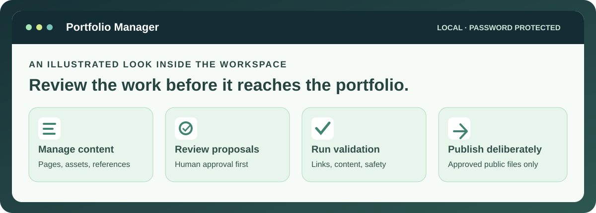

# Haley Reeder · Instructional Design Portfolio

**Learning experiences, AI evaluation, LMS administration, and the systems that connect them.** This portfolio pairs finished work with interactive examples so you can explore both the learner experience and the decisions behind it.

**[Explore the portfolio →](https://reeder-design.github.io/id-portfolio-system/)** &nbsp;·&nbsp; **[Browse all projects →](https://reeder-design.github.io/id-portfolio-system/projects/)** &nbsp;·&nbsp; **[Ask Haley →](https://reeder-design.github.io/id-portfolio-system/hiring-manager/)**

## A good place to start

1. **Try a learning experience:** [interactive learning projects](https://reeder-design.github.io/id-portfolio-system/projects/instructional-design/interactive-learning/).
2. **Explore platform work:** [LMS administration](https://reeder-design.github.io/id-portfolio-system/projects/lms-administration/) and the [LMS demos](https://reeder-design.github.io/id-portfolio-system/projects/lms-administration/my-approach-for-various-lms-platforms/).
3. **See how the work connects:** [workflows, automation, and reporting](https://reeder-design.github.io/id-portfolio-system/projects/workflows/).

## Public portfolio · private workspace

**Public:** The [portfolio](https://reeder-design.github.io/id-portfolio-system/) and its project demos open in a browser without an account.

**Local and password-protected:** Portfolio Manager is my editing, review, and publishing workspace. It runs on my computer; the live portfolio does not expose it.

[See how the public sites and local managers connect →](https://reeder-design.github.io/id-portfolio-system/projects/github-workflow/) · [Read the repository guide →](docs/repository-guide.md)
